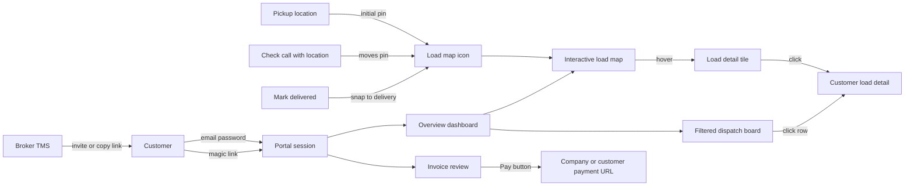

# Customer-facing portal dashboard

**Overview:** Add a customer portal with login or magic links, an overview dashboard (map pins start at pickup, move with check calls, snap to delivery when delivered), customer-safe load details, and invoice review with a payment link.

## Implementation todos

- [ ] Add portal auth models, payment URLs, geocode cache on `LoadStop` + `CheckCall`; migrate
- [ ] Geocode check-call locations on create; map pin: pickup → check calls → delivery on `DELIVERED+`
- [ ] Implement portal-auth, proxy public `/portal` paths, login/invite/magic-link flows
- [ ] Overview: metrics + map (pickup/check-call/delivery rules) + filtered dispatch board
- [ ] Customer-safe load detail page opened from map tile or board row
- [ ] Portal invoice list/detail, safe doc download, Pay URL CTA
- [ ] Customer detail Portal access tile + company/customer payment URL settings

## Context

Today the app is broker-only: staff auth via [`lib/auth.ts`](../lib/auth.ts) / `tms_session`, Customers are CRM records ([`Customer`](../prisma/schema.prisma)), and the dispatch board ([`components/dispatch-board.tsx`](../components/dispatch-board.tsx)) exposes carrier rate and margin columns. Maps today are **per-load route only** ([`components/load-route-map.tsx`](../components/load-route-map.tsx) + [`lib/google-maps.ts`](../lib/google-maps.ts)); there is no multi-load map and **no stored lat/lng** — coords are geocoded on demand from stop/city text. Check calls are free-text locations only.

## Approach

Ship a separate **customer portal** under `/portal/*` with its own session cookie (`tms_portal_session`), scoped to one `Customer`. Brokers manage access from the customer detail page. Portal data is **whitelisted** — never query or serialize carrier pay, margins, commissions, or private notes.

**Home experience:** overview + their dispatch board + an interactive map of all their loads. Hover a marker → small detail tile (load #, origin, destination). Click the tile (or marker) → customer-safe load detail.

**Load icon position:**

1. Starts at the **pickup** location
2. Each check call with a geocodable location **moves** the icon to that reported position
3. When the load is marked **delivered** (status → `DELIVERED` or beyond: invoiced/paid), the icon **snaps to the final delivery** location (latest check-call no longer overrides)

**Payment link (v1):** brokers configure a remittance/payment URL on the company (optional per-customer override). Open invoices show a **Pay** button to that URL. Stripe Connect card capture for AR is out of scope for this pass.

## Data model ([`prisma/schema.prisma`](../prisma/schema.prisma))

Add:

- **`CustomerPortalUser`** — `companyId`, `customerId`, `email` (unique per company), `name`, `passwordHash`, `status` (`ACTIVE` / `INVITED` / `DISABLED`), invite token fields (mirror staff invite pattern in [`lib/auth.ts`](../lib/auth.ts))
- **`CustomerPortalSession`** — hashed token, either `portalUserId` or `portalLinkId`, `customerId`, `expiresAt` (e.g. 7 days for password sessions; link sessions can match link expiry or 24h)
- **`CustomerPortalLink`** — magic access: `companyId`, `customerId`, hashed token, `label`, `expiresAt`, `revokedAt`, `createdByUserId`
- **`Company.customerPaymentUrl`** — optional AR remittance / pay portal URL
- **`Customer.paymentUrl`** — optional override when set
- **Geocode cache on `LoadStop`:** `latitude`, `longitude`, `geocodedAt` (nullable) — for origin/destination fallback pins; backfill lazily on map load when missing
- **Geocode cache on `CheckCall`:** `latitude`, `longitude`, `geocodedAt` (nullable) — set when the check call is created so the customer map can move the load icon without re-geocoding every view

Migration + Prisma client regenerate as usual.

### Check-call → map icon

Hook into [`addCheckCall`](../lib/actions.ts): after creating the `CheckCall` with its text `location`, call `geocodeAddress(location)` (existing [`lib/google-maps.ts`](../lib/google-maps.ts)). On success, persist `latitude` / `longitude` / `geocodedAt` on that row. On failure, leave coords null (map keeps prior position; board still shows the text location).

Map plot priority for **one marker per load**:

1. If load status is **`DELIVERED`, `INVOICED`, or `PAID`** → **final delivery** stop/city coords (marking delivered snaps the icon here; later check calls do not move it off delivery)
2. Else if there is a **latest check call with stored coords** (by `occurredAt`) → use that reported position (moves the icon along the trip)
3. Else → **pickup** stop/city coords (initial position for every load)

Ensure delivery-status transitions (whatever path sets status to `DELIVERED` today) need no special client logic — the resolver above re-evaluates from `load.status` on each map load. Optionally geocode/cache delivery `LoadStop` eagerly when status becomes `DELIVERED` so the snap is immediate without a lazy miss.

Hover tile always shows load #, origin, and final destination; when the pin is from a check call, also show last reported location text.

## Auth and routing

- New [`lib/portal-auth.ts`](../lib/portal-auth.ts): hash/verify password (reuse scrypt helpers), create/destroy portal sessions, `getPortalViewer()` returning `{ customerId, companyId, companyName, customerName, accessMode: "user" | "link" }`
- Update [`proxy.ts`](../proxy.ts): treat `/portal` as **not** requiring staff `tms_session`; portal pages enforce portal session themselves (except login + magic-link redeem + invite accept)
- Magic link redeem: `GET /portal/access/[token]` → portal session → `/portal`
- Password login: `/portal/login`
- Invite accept: `/portal/accept-invite?token=…`
- Portal never uses seats, branch scope, or staff roles

## Customer UI (read-only)

Lightweight layout (no staff AppShell) — broker company name/logo when available. Nav: Overview | Board | Invoices | Sign out.

| Route | Purpose |
|-------|---------|
| `/portal` | **Overview dashboard** (metrics + map + board preview or full board) |
| `/portal/board` | Full filtered dispatch board (same columns, stage chips) |
| `/portal/loads/[id]` | Customer-safe load detail (from map tile or board) |
| `/portal/invoices` | Invoice list |
| `/portal/invoices/[id]` | Invoice detail + doc download + Pay CTA |

### Overview dashboard (`/portal`)

One page composition with:

1. **Summary strip** — counts keyed off existing board stages for *this customer only* (e.g. Active, En Route, Completed, Open invoices / balance). No margin or carrier-cost metrics.
2. **Interactive map** — primary visual: markers for the customer’s non-canceled loads.
3. **Dispatch board** — same customer-safe board below (or linked section); stage filters work as on the internal board.

### Interactive load map

Reuse existing stack: **Leaflet + OSM tiles** (as in [`load-route-map.tsx`](../components/load-route-map.tsx)), server geocode via [`geocodeAddress`](../lib/google-maps.ts). New pieces:

- [`lib/customer-load-map.ts`](../lib/customer-load-map.ts) — resolve **one marker per load** using the pickup → check-call → delivery-on-complete rules above; include `originLabel`, `destinationLabel`, and optional `lastReportedLocation` for the hover tile
- Map payload (RSC props or [`GET /api/portal/loads/map`](../app/api/portal/loads/map/route.ts)) — `{ id, loadNumber, status, boardStage, originLabel, destinationLabel, lat, lng, lastReportedLocation? }` only; never financials
- [`components/customer-load-map.tsx`](../components/customer-load-map.tsx):
  - Status-colored load icons; visually distinguish “reported position” (from check call) vs fallback stop pin if useful
  - **Hover** → floating detail **tile**: load number, origin (`city, ST`), final destination (`city, ST`), short status (and last reported location when from a check call)
  - **Click tile or marker** → navigate to `/portal/loads/[id]`
  - Fit bounds to markers; empty state when no plottable loads
  - Start without clustering; add later if needed

Do not call the full [`/api/loads/[id]/route`](../app/api/loads/[id]/route/route.ts) Routes API for the overview (too heavy); scatter map only.

### Dispatch board (customer-safe)

Reuse stage helpers from [`lib/dispatch-board.ts`](../lib/dispatch-board.ts) (`getLoadBoardStage`) via [`lib/customer-board.ts`](../lib/customer-board.ts).

**Columns:** load #, stage/status, lane, pickup/delivery dates, equipment, commodity, **carrier name**, **driver name/phone**, truck/trailer, last check-call location/time. **Omit:** customer column, `carrierRate`, revenue/margin/`carrierCostCents`.

Queries always: `where: { companyId, customerId, status: { not: "CANCELED" } }`. Row click → `/portal/loads/[id]`.

### Load detail (`/portal/loads/[id]`)

Read-only, customer-filtered:

- Load #, status/stage, reference #, equipment, commodity, weight
- Origin / destination and stop list (facility names + cities — no internal notes)
- Assigned **carrier name**, **driver name/phone**, truck/trailer
- Last check call (location/status/time) if present
- Optional single-load route map (reuse `LoadRoutePanel` pattern) only after ownership check
- Customer-facing documents (invoice, load confirmation, BOL, POD) — strip private docs
- **Never:** carrier rate, pay lines, expenses, margin, commissions, private notes

Unauthorized / other-customer load IDs → `notFound()`.

### Invoices

Non-`VOID` invoices for that customer; `invoiceNo`, status, totals, balance, dates; portal-safe document download (session must own `customerId`). **Pay button:** `Customer.paymentUrl ?? Company.customerPaymentUrl`; hide if unset.

## Broker admin (manage access)

On [`app/customers/[id]/page.tsx`](../app/customers/[id]/page.tsx), **Portal access** tile (write users):

- Invite contact by email → `CustomerPortalUser` + accept-invite email
- List/disable portal users
- Create/revoke magic links (copy URL once)
- Edit customer payment URL override

Company-level `customerPaymentUrl` next to existing company profile fields.

Server actions in [`lib/portal-admin-actions.ts`](../lib/portal-admin-actions.ts) gated by `requireWriteUser` + same-company/`canAccessRecord`.

## Security checklist

- Separate cookies/sessions from staff auth
- All portal queries scoped by session `customerId` + `companyId`
- Rate-limit portal login / invite accept
- Magic tokens hashed; raw shown once
- Map/API/doc routes require portal session + ownership
- No seats or staff routes for portal users

## Out of scope (this PR)

- Stripe Connect / card capture applying AR payments
- Live ELD/GPS / telematics feeds (position updates come from check-call location text + geocode, not continuous tracking)
- Customer editing loads or uploading docs
- Multi-customer portal users (one user → one customer)
- Carrier-facing portal
